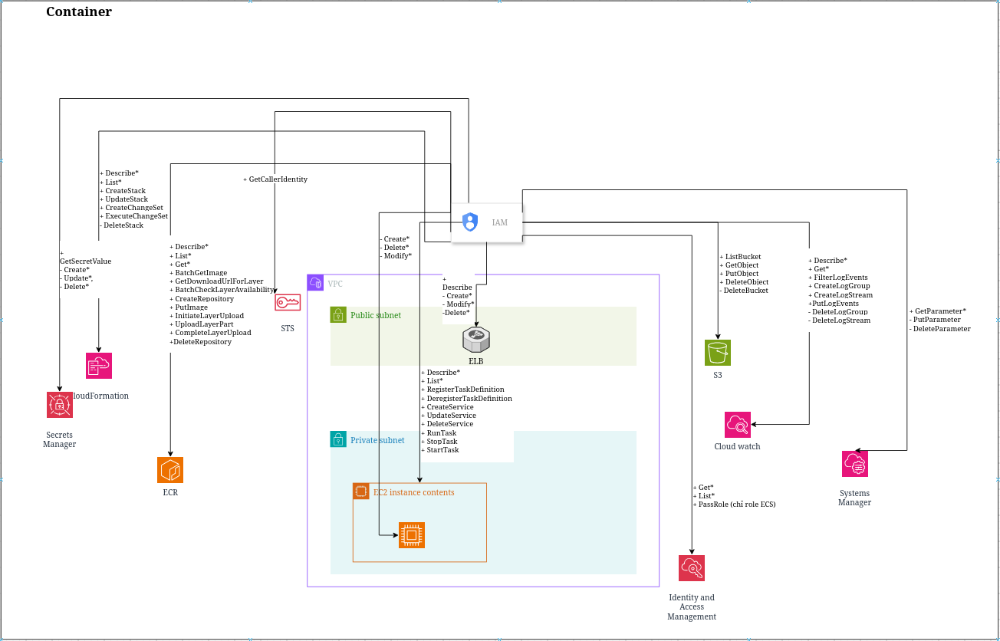
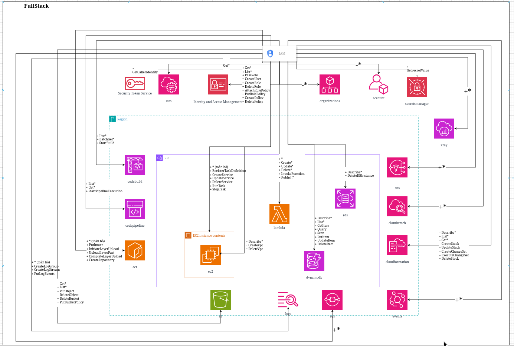
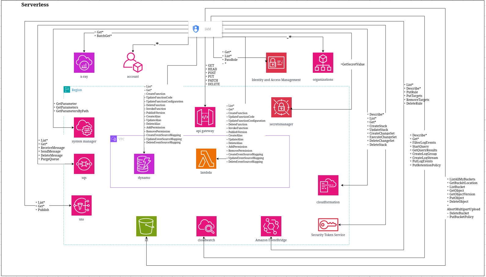
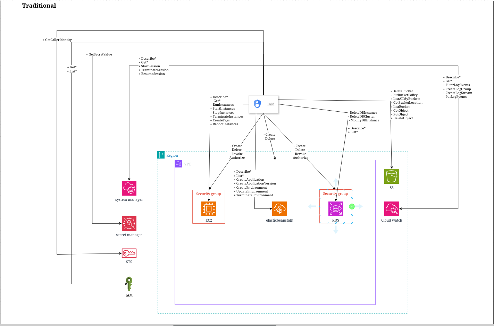

# IAM Developer Policy Reference

This repository contains a set of AWS IAM policy examples and architecture diagrams for common developer access patterns. Each policy is designed to give engineers the permissions needed to operate a specific application architecture while blocking the most dangerous administrative and destructive actions.

## Repository contents

- `container.json` — IAM permissions for container-based workloads using ECS, ECR, ELB, S3, CloudWatch, Secrets Manager, and IAM.
- `full_stack.json` — IAM permissions for a mixed full-stack environment with Lambda, ECS, EC2, RDS, S3, DynamoDB, SQS, SNS, and CI/CD services.
- `serverless.json` — IAM permissions for a serverless application using API Gateway, Lambda, DynamoDB, S3, EventBridge, CloudWatch, and Secrets Manager.
- `traditional.json` — IAM permissions for a traditional web application running on EC2 and Elastic Beanstalk with RDS, S3, SSM, CloudWatch, and Secrets Manager.
- `Diagrams/` — exported architecture diagrams for each deployment pattern.

## Architecture diagrams

### 1. Container architecture

This diagram represents a containerized workload running on ECS with supporting services such as ECR, ELB, S3, CloudWatch, Secrets Manager, and IAM. The policy is intentionally scoped to service operations, image management, log access, and secure runtime configuration.

### 2. Full stack architecture

This diagram covers a hybrid full-stack deployment combining Lambda, ECS, CodeBuild, CodePipeline, EC2, RDS, DynamoDB, S3, SNS, SQS, CloudWatch, and X-Ray. The associated IAM policy balances application development actions with explicit deny rules for high-risk identity and infrastructure changes.

### 3. Serverless architecture

This diagram focuses on a serverless application built around API Gateway, Lambda, DynamoDB, S3, EventBridge, CloudWatch, and Secrets Manager. The policy allows code and runtime operations while restricting destructive actions such as bucket deletion, table deletion, or stack teardown.

### 4. Traditional architecture

This diagram illustrates a traditional web application hosted on EC2 and Elastic Beanstalk with supporting resources including S3, RDS, CloudWatch, SSM, and Secrets Manager. The policy enables environment troubleshooting, deployment actions, and infrastructure inspection while denying dangerous management operations.

## Design principles

These policies follow a consistent pattern:

- Read access to inspect resources and logs
- Write access for deployment and runtime changes
- Limited IAM pass-role permissions only for approved services
- Explicit deny rules for high-risk administrative and destructive actions
- Least-privilege access suitable for developer workflows

## Notes

The diagrams are exported PNG assets and can be used as references for architecture reviews, policy design discussions, and developer onboarding. The JSON files represent the underlying IAM policies that correspond to the illustrated environments.

## Related diagram source

The original editable diagram source is linked here:

https://viewer.diagrams.net/?tags=%7B%7D&lightbox=1&target=blank&highlight=0000ff&edit=_blank&layers=1&nav=1&title=IAM-developer-policy.drawio&dark=auto#Uhttps%3A%2F%2Fdrive.google.com%2Fuc%3Fid%3D1cjFt_uDljiLi7dxoT8btXAlhZO58VOGt%26export%3Ddownload

